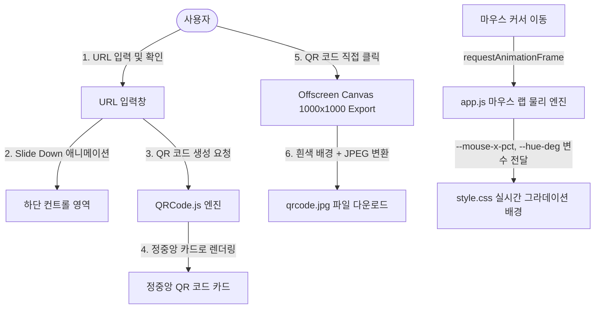

# 🚀 QR Craft - 프로젝트 구현 계획, 워크스루 및 작업 목록

---

## 📋 1. 구현 계획 (Implementation Plan)

### 🎯 프로젝트 목표
- **로고 조화형 라이트 테마 구축**: `img/logo.png` 로고의 분위기에 맞춰 화사하고 세련된 라이트 톤의 파스텔 글래스모피즘 디자인 구현.
- **인터랙티브 동적 레이아웃**: 초기 중앙 URL 입력창이 확인 시 화면 하단으로 부드럽게 Slide Down하며, 정중앙에 QR 코드가 팝업되는 시각적 UX 제공.
- **마우스 커서 반응형 그라데이션**: 사용자의 마우스 커서 위치(`X`, `Y`)를 60fps로 추적하여 실시간으로 배경 그라데이션 색상과 각도가 변화하는 물리 엔진 구현.
- **고화질 JPG 다운로드**: QR 코드를 클릭하면 투명 배경 검은색 왜곡 없이 깨끗한 흰색 바탕 1000x1000 고해상도 `.jpg` 파일로 즉시 저장.

### 🏗️ 시스템 아키텍처

---

## 🚶‍♂️ 2. 워크스루 (Walkthrough)

### 1️⃣ 초기 상태 (Initial Hero View)
- 화면 상단 좌측에 비율(306x79)이 보존된 [`logo.png`](file:///c:/Users/user/Desktop/프로젝트04/img/logo.png)가 입체적 글래스 프레임 안에 깔끔하게 표시됩니다.
- 화면 중앙에는 큰 메인 타이틀과 함께 신뢰감을 주는 URL 입력 창, 빠른 테스트용 추천 태그(`Google`, `Naver`, `YouTube`, `GitHub`)가 위치합니다.
- 마우스를 화면 내에서 움직이면 커서 위치를 따라 **배경의 은은한 인디고-바이올렛-핑크 파스텔 그라데이션이 실시간으로 이동 및 색상 변화**합니다.

### 2️⃣ URL 확인 및 동적 전환 (Dynamic State Transition)
- URL을 입력하고 **[확인]** 버튼을 클릭하거나 `Enter`를 누르면:
  - URL 입력창이 부드러운 CSS cubic-bezier 커브를 따라 **화면 하단으로 이동**합니다.
  - 화면 **정중앙 stage**에 스캔 애니메이션 라인과 함께 글래스 QR 카드가 등장합니다.

### 3️⃣ 클릭을 통한 JPG 저장 (Click-to-Download JPG)
- 생성된 **QR 코드를 마우스로 직접 클릭**하면 호버 오버레이(`💾 JPG 다운로드`)가 작동하며, 브라우저 다운로드가 자동으로 실행됩니다.
- JPG 파일 특성상 배경이 검게 변하는 현상을 방지하기 위해 Canvas 내부에 순백색(`#FFFFFF`) 바탕을 자동 합성하여 저장됩니다.
- 다운로드 완료 시 우측 하단에 성공 토스트 알림이 표시됩니다.

---

## ✅ 3. 작업 목록 (Task List)

- [x] **기본 구조 및 HTML5 템플릿 작성**
  - 상단 좌측 로고, 메인 센터 영역, 하단 이동 입력 폼 구성을 담은 [`index.html`](file:///c:/Users/user/Desktop/프로젝트04/index.html) 구현.
- [x] **라이트 톤 & 글래스모피즘 CSS 스타일링**
  - 밝은 보라/파란 톤 UI, 입체 섀도우, 모던 폰트(`Plus Jakarta Sans`)를 반영한 [`style.css`](file:///c:/Users/user/Desktop/프로젝트04/style.css) 제작.
- [x] **로고 크기 및 비율 최적화**
  - 306x79 해상도의 로고 이미지 비율이 고스란히 유지되도록 `.header-logo` 높이(44px) 및 자동 가로폭 조율.
- [x] **마우스 커서 추적 그라데이션 연동**
  - [`app.js`](file:///c:/Users/user/Desktop/프로젝트04/app.js)에 `requestAnimationFrame` 물리 보정 기반의 커서 `X/Y` 좌표 추적 엔진 구현.
- [x] **URL 입력창 하단 이동 애니메이션**
  - `body.state-generated` 클래스 토글을 통한 부드러운 Layout Shift CSS 구현.
- [x] **QR 코드 Canvas 생성 및 JPG 변환 다운로드**
  - `QRCode.js` 라이브러리 연동 및 1000x1000 픽셀 규격의 순백색 바탕 `.jpg` 이미지 다운로드 기능 연동.
- [x] **로컬 서버 검증 완료**
  - Python HTTP Server (`http://localhost:8080`) 가동 확인.

---

### 📂 핵심 관련 파일 목록
- [`index.html`](file:///c:/Users/user/Desktop/프로젝트04/index.html) - 앱 메인 구조
- [`style.css`](file:///c:/Users/user/Desktop/프로젝트04/style.css) - 라이트 테마 & 마우스 반응형 그라데이션 스타일
- [`app.js`](file:///c:/Users/user/Desktop/프로젝트04/app.js) - 인터랙션 및 JPG 다운로드 로직
- [`img/logo.png`](file:///c:/Users/user/Desktop/프로젝트04/img/logo.png) - 상단 좌측 로고 이미지
